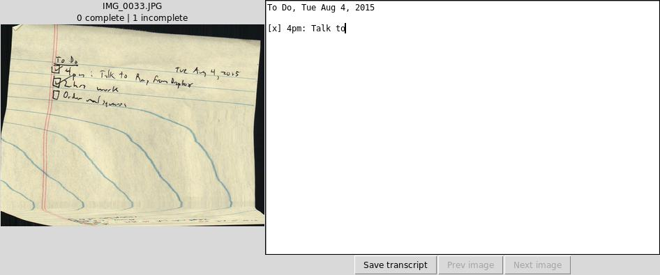

# transcribe
Small graphical tool for transcribing scanned documents by hand.

```
Usage: transcribe.py FILE [FILE...]
```



On one side of the screen the image is displayed (my scanner sucks, as you can see). On the other, you type what you see. When you're done, press "next". When all the images are transcribed, you can exit the program (progress is shown).

The transcriptions are just saved as (for the example file IMG_0033.JPG): IMG_0033.JPG.txt, etc.
